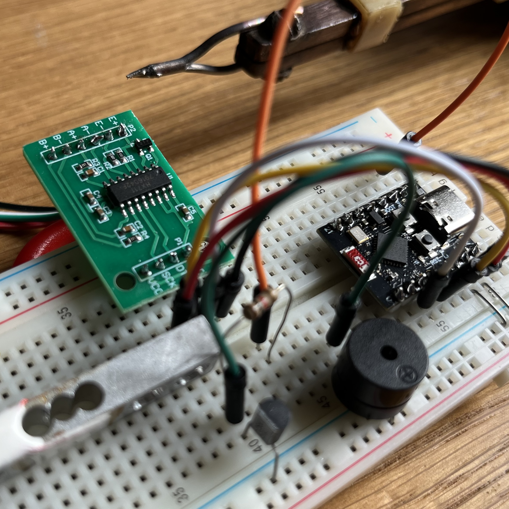
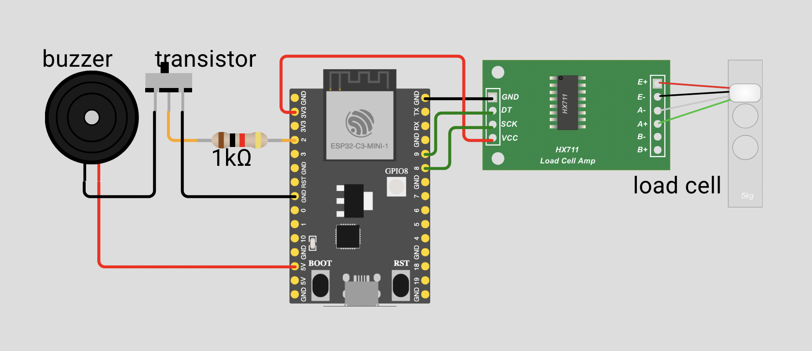

# Rust-Powered Smart Trash Bin (Garbage Collector, kind of)



## Overview

This project was prepared for the Rust Warsaw Meetup.
It is a fun and practical IoT device: a smart trash bin that detects when it’s full and buzzes to let you know it’s time to take out the trash.  
It’s powered by an ESP32-C3 microcontroller and written entirely in Rust.

- **Detects weight** using a load cell and HX711 amplifier
- **Buzzes** when the bin is full (weight threshold exceeded)
- **Logs weight readings** to the serial console
- **Beginner-friendly** Rust code and hardware setup

Presentation slides: [presentation.pdf](presentation.pdf)

## Hardware Used

- **ESP32-C3** development board
- **Load cell** (weight sensor)
- **HX711** load cell amplifier/ADC module
- **Active buzzer** (5V, controlled via NPN transistor, e.g. BC550C)
- **NPN transistor** (e.g. BC550C) + 1kΩ resistor (for buzzer switching)
- Breadboard and jumper wires

### Wiring Diagram

| Component    | ESP32-C3 Pin | Notes                                 |
|--------------|--------------|---------------------------------------|
| HX711 DT     | GPIO2        | Data pin                              |
| HX711 SCK    | GPIO3        | Clock pin                             |
| Buzzer (+)   | 5V           |                                      |
| Buzzer (–)   | Collector of NPN transistor |                        |
| Transistor base | GPIO5 via 1kΩ resistor |                          |
| Transistor emitter | GND     |                                      |



## How It Works

1. The load cell senses the weight of the trash bin.
2. The HX711 module amplifies and digitizes the signal.
3. The ESP32-C3 reads the weight value.
4. If the weight is above a set threshold, the buzzer turns on.
5. Otherwise, the buzzer stays off.
6. Weight readings are logged every second for debugging.

## Getting Started

### Prerequisites

- [Rust toolchain](https://rustup.rs/)
- [espup](https://github.com/esp-rs/espup) for ESP32 Rust setup
- [esp-idf-sys](https://github.com/esp-rs/esp-idf-sys) and [esp-idf-hal](https://github.com/esp-rs/esp-idf-hal) crates
- [cargo-generate](https://github.com/cargo-generate/cargo-generate) for project templates

### Quick Start

1. **Set up Rust for ESP32:**
   ```sh
   cargo install espup
   espup install
   source ~/export-esp.sh
   ```

2. **Generate a new project:**
   ```sh
   cargo generate --git https://github.com/esp-rs/esp-idf-template cargo
   ```

3. **Clone this repo and build:**
   ```sh
   git clone https://github.com/Artur-Sulej/esp_load_cell
   cd esp_load_cell
   cargo build
   ```

4. **Flash to your ESP32-C3:**
   ```sh
   cargo run
   # or use espflash if needed
   ```

## Why Rust and ESP32?

- **Rust** is safe, modern, and fun for embedded projects.
- **ESP32-C3** is a powerful, WiFi-enabled microcontroller for just a few dollars.
- The [esp-idf](https://github.com/espressif/esp-idf) ecosystem brings robust drivers and FreeRTOS support to Rust.

## Credits

- Inspired by the Rust Warsaw Meetup community
- Thanks to @Gosia Haruba and vlayer labs for organizing the event!

## License

MIT
